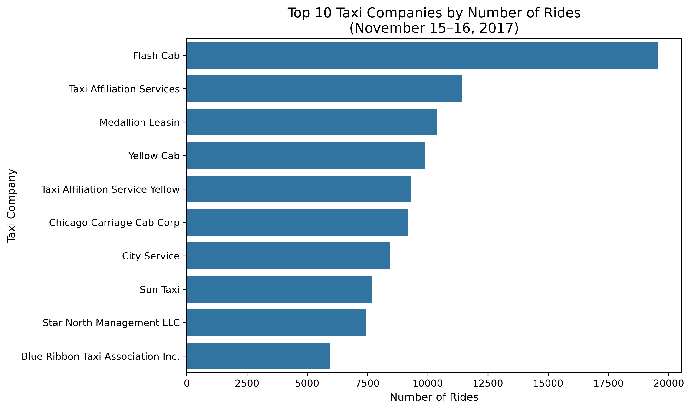
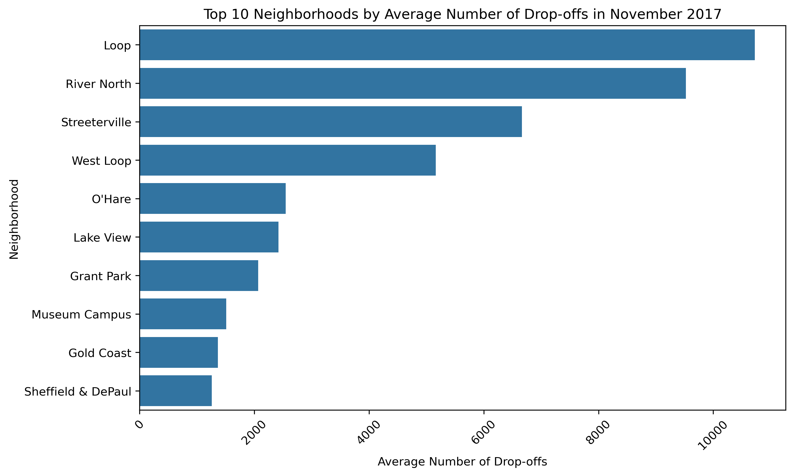

# Taxi Demand Analysis Using SQL and Python

This project analyzes Chicago taxi trip data to identify competitor activity, neighborhood-level demand patterns, and the effect of weather on ride duration. Using **SQL** for data extraction and preparation and **Python** for exploratory analysis, visualization, and hypothesis testing, the project demonstrates an end-to-end analytics workflow in a transportation market context.

## Business Context

The analysis is framed around a market-entry scenario for **Zuber**, a fictional ride-sharing company evaluating expansion into Chicago. The project focuses on three main business questions:

1. Which taxi companies handled the most rides during selected periods in November 2017?
2. Which Chicago neighborhoods had the highest average number of drop-offs?
3. Did rainy weather affect trip duration for rides from the **Loop** to **O’Hare International Airport** on Saturdays?

## Dataset

The analysis uses four relational tables:

- **cabs** — taxi company information
- **trips** — trip-level ride data
- **neighborhoods** — neighborhood identifiers and names
- **weather_records** — hourly weather observations

Relevant trip fields include ride start time, end time, duration, distance, pickup location, and drop-off location. Weather conditions were connected to trips by matching trip start timestamps with weather record timestamps.

## Tools and Technologies

- **SQL (PostgreSQL)**
- **Python**
- **Pandas**
- **Matplotlib**
- **Seaborn**
- **SciPy**
- **Jupyter Notebook**

## Methodology

### SQL Analysis

The SQL portion of the project was used to answer several market and operational questions:

- count the number of taxi rides for each company on **November 15–16, 2017**
- count rides for companies whose names contain **"Yellow"** or **"Blue"** on **November 1–7, 2017**
- group **Flash Cab**, **Taxi Affiliation Services**, and all remaining companies into broader comparison categories
- retrieve the neighborhood identifiers for the **Loop** and **O’Hare**
- classify hourly weather conditions as **Good** or **Bad** using a `CASE` statement
- join weather data to Saturday rides from the **Loop** to **O’Hare** and retrieve trip duration for hypothesis testing

### Python Analysis

The Python portion of the project focused on:

- importing and reviewing the extracted datasets
- checking data structure and data types
- identifying the **top 10 neighborhoods** by average drop-offs
- creating visualizations for taxi company ride counts
- creating visualizations for top neighborhoods by drop-offs
- drawing conclusions from the observed patterns

### Hypothesis Testing

The final stage of the project tested whether the **average duration of rides from the Loop to O’Hare changes on rainy Saturdays**. The dataset used for this test included:

- `start_ts`
- `weather_conditions`
- `duration_seconds`

## Visualizations

### Top 10 Taxi Companies by Ride Count

### Top 10 Neighborhoods by Average Drop-offs

## Key Findings

- **Flash Cab** recorded the highest ride count during November 15–16, 2017, followed by **Taxi Affiliation Services** and **Medallion Leasing**.
- Among companies with **"Yellow"** or **"Blue"** in their names, **Yellow Cab** and **Taxi Affiliation Service Yellow** had the highest ride totals during November 1–7, 2017.
- The neighborhoods with the highest average drop-offs were **Loop**, **River North**, **Streeterville**, and **West Loop**, indicating concentrated demand in major commercial and high-traffic areas.
- Weather conditions were associated with statistically significant differences in ride duration for Saturday trips from the **Loop** to **O’Hare**.

## Business Impact

This project shows how SQL and Python can be combined to support transportation and operations analysis. The findings suggest that:

- a small number of taxi companies accounted for a large share of rides
- demand was concentrated in a handful of key neighborhoods
- weather conditions should be considered in trip planning and operational forecasting

## Files

- `taxi-demand-analysis.ipynb` — main notebook containing analysis, visualizations, and hypothesis testing
- `taxi-demand-queries.sql` — SQL queries used to extract and prepare the data
- `data/` — exported datasets used in the notebook
- `images/` — charts used in the README
- `chicago-weather-records-nov-2017.pdf` — supporting weather reference file
- `README.md` — project overview and documentation

## Status

Completed.
